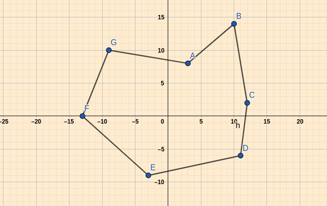
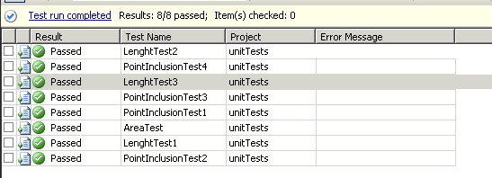

22.06.2020

## 
Przetwarzanie danych przestrzennych dwuwymiarowych z wykorzystaniem własnych typów danych w MS SQL SERVER 

Hubert Mazur

### 
1. Opis problemu 

Celem projektu, było stworzenie API umożliwiającego przetwarzanie danych przestrzennych dwuwymiarowych z wykorzystaniem funkcjonalności oferowanej przez MS SQLSERVER związanej z tworzeniem własynych typów danych oraz funkcji (user-defined-types).

### 
2. Opis funkcjonalności API 

Zaimplementowane API umożliwia dodanie dowolnej ilości punktów określonych współrzędnymi (dwa wymiary). Dla punktów, możliwe jest wyznaczenie odległości między nimi. Dodatkowo, z wyznaczonych punktów możliwe jest utworzenie dowolnego wielokąta (kolejność punktów przechowywanych w bazie danych ma znaczenie). Na wielokącie rozpiętym na punktach możliwe są operacje obliczenia pola oraz sprawdzenia, czy dany punkt należy do obszaru.

Aplikacja konsolowa w języku C# umożliwia połączenie z bazą danych poprzez interfejs ADO.NET. Aplikacja automatycznie dokonuje inicjalizacji potrzebnych funkcjonalności- tworzy tabelę przechowującą punkty, oraz tabelę dla utworzonego z punktów wielokąta. Interfejs aplikacji poprzez wywołanie odpowiednich funkcji unożliwia realizację wcześniej wspomnianych celów.

### 
3. Opis typów danych oraz metod udostępnianych w ramach API 

Aplikacja konsolowa w języku C# łączy się z silnikiem bazy danych i wykorzystuje typy oraz metody tam zdefiniowane, tzn. np. obliczanie pola  wielokąta odbywa się po stronie bazy danych i zwracany jest wynik, a nie po stronie aplikacji klienckiej (wysyłającej żądanie). Logika opiera się na zdefiniowanych i dołączonych przez użytkownika do bazy typach danych. Typy danych zostały stworzone w języku C#.

Istnieją dwie główne klasy:
- Point- klasa reprezentująca pojedynczy punkt na płaszczyźnie, ważne metody klasy:
  - ToString- konwertuje punkt do postaci tekstowej
  - distance- umożliwia wyznaczenie odległości pomiędzy punktami
  
- Polygon- klasa reprezentująca wielokąt opięty na punktach, ważne metody klasy:
  - Load- dodaje punkt do wielokąta
  - ToString- reprezentacja tekstowa wielokąta
  - IncludedPoints- liczba punktów w wielokącie
  - isPointInside- sprawdza, czy punkt o danych koordynatach znajduje się węwnątrz wielokąta
  - calculate_area- oblicza pole wielokąta

Klasy dodatkowe, niezwiązane z bazą danych:
- DBConnection- klasa odpowiadająca za połączenie z bazą danych, inicjalizująca potrzebne struktury (np. tabele) oraz udostępniająca funkcjonalność.
- UnitTest- klasa odpowiadająca za realizację testów jednostkowych dla projektu.

### 
4. Opis implementacji 

W projekcie wykonywane są obliczenia numeryczne, w związku z czym, ta część dokumentu poświecona jest opisowi algorytmów.

- Odległość między dwoma punktami liczona jest w standardowy sposób: dla punktów P, V

przy czym x oraz y oznaczają współrzędne punktów.

- Sprawdzenie, czy punkt należy do obszaru odbywa się za pomocą algorytmu wykorzystującego [indeks punktu względem krzywej](https://pl.wikipedia.org/wiki/Indeks_punktu_wzgl%C4%99dem_krzywej) (winding number). W skrócie- algorytm "liczy" ile razy okrąża się dany punkt jeżeli podąża się wzdłuż wybranej krzywej. Jeżeli liczba jest równa 0, wówczas punkt znajduje się na zewnątrz. W przeciwnym wypadku- wewnątrz. W tym konkretnym przypadku, nie ma ciągłej krzywej, a są dyskretne wartości (punkty)- w związku z czym wyjściowa całka zamienia się w sumę. Algorytm ten wykorzystuje również pomocniczą metodę determinującą położenie jednego punktu względem prostej.  [Opis metody oraz wykorzystanego algorytmu wraz z wyjaśnieniem autorstwa Dan'a Sunday'a.](http://geomalgorithms.com/a03-_inclusion.html)

- Obliczanie pola wielokąta- zaimplementowany w ramach pracy algorytm umożlwia policzenie w sposób numeryczna pola dowolnego wielokąta przy użyciu metody Monte Carlo. 
Schemat algorytmu:
    - dowolny wielokąt należy wpisać w opinający prostokąt (minimal bounding box)
    - należy wyznaczyć pole prostokąta
    - wylosować 1000000 punktów z przedziału prostokąta (tak, aby każdy wylosowany punkt zawierał się w prostokącie) i sprawdzać, czy punkt zawiera się w wielokącie- jeśli tak, dodać do sumy trafień w wielokąt
    - pole wielokąta liczone jako:
  
  

### 
5. Zawartość repozytorium

Opis zawartości repozytorium:
- Katalog 'Projekt'- zawiera projekt z klasami reprezentującymi punkt oraz wielokąt, stanowią implementację własnych typów danych CLR UDT
- Katalog 'Testy':
    - Katalog 'test'- zawiera projekt wraz zklasą DBConnection odpowiadającą za połączenie z bazą danych
    - Katalog 'unitTests'- zawiera projekt z testami jednostkowymi dla projektu
- Plik DataBase_Setup- zawiera plik inicjalizacyjny bazy danych w SQL SERVER, odpowiada za utworzenie testowej bazy danych (testDB), oraz procedur: tworzącej tabele, usuwającej tabele, wypełniającej wielokąt punktami (używany kursor)

### 
6. Uruchomienie

W celu uruchomienia całęgo projektu należy:
- uruchomić skrypt DataBaseCreation- utworzenie bazy danych
- uruchomić projekt 'Projekt', wybrać odpowiednią bazę danych (testDB) i dokonać 'deploy' do bazy danych zdefiniowanych struktur danych
- uruchomić skrypt DataBase_Setup (stworzenie wymaganych procedur w bazie danych)
- uruchomić projekt 'test' oraz projekt 'UnitTests', następnie włączyć testy jednostkowe, lub wykorzystać interfejs dotępu do bazy danych w dowolny sposób (policzyć pole dowolnego wielokąta)

### 
7. Testy jednostkowe

Dla projektu wykonane zostało 8 testów jednostkowych sprawdzających poprawnośc działania:
- 1 dla obliczenia pola
- 3 dla odległości punktów
- 4 dla zawierania się punktu

Testy wykonane zostały dla wybranego wielokąta, którego punkty miały wspólrzędne:
- A(3,8)
- B(10,14)
- C(12,2)
- D(11,-6)
- E(-3,-9)
- F(-13,0)
- G(-9,10)

Wielokąt poddawany testom:

- Test pola- oczekiwane pole: 373, obliczone: 373.21
- Test odległości punktów (B,E)- oczekiwana odległość: 26.41, obliczona: 26.41
- Test odległości punktów (A,B)- oczekiwana odległość: 9.22, obliczona: 9.21
- Test odległości punktów (D,F)- oczekiwana odległość: 24.74, obliczona: 24.73
- Test 1 zawierania (punkt (0,0)): oczekiwane: zawiera się, obliczone: zawiera się
- Test 2 zawierania (punkt (-22,0)): oczekiwane: nie zawiera się, obliczone: nie zawiera się 
- Test 3 zawierania (punkt (165,9)): oczekiwane: nie zawiera się, obliczone: nie zawiera się
- Test 4 zawierania (punkt (8,-3)): oczekiwane: zawiera się, obliczone: zawiera się

Wynik testu jest pozytywny, jeżeli obliczony wynik nie różni się bardziej od oczekiwanego niż 1% wartości oczekiwanej.

Rezultat przeprowadzonych testów:

### 
8. Typy oferowane przez SQL SERVER

SQL SERVER w ramach funkcjonalności .NET CLR udostępnia typy danych, które reprezentują typy geograficzne. Spośród kilku, dla tego projektu należy wspomnieć o 'Punkt' oraz 'Wielokąt'. 
- Punkt jest typem geograficznym o dwóch współrzędnych- szerokości i długości geograficznej, które są podane w stopniach. 
- Istnieje również typ 'Punkt' interpretowany jako geometryczna jednostka, reprezentująca położenie poprzez dwie współrzędne- x oraz y.
- Wielokąt jako typ może zostać stworzony, jeśli ma co najmniej trzy różne punkty. Dodatkowo, SQL SERVER dopuszcza istnienie innego wielokąta zawartego w środku kolejnego (w tej implementacji nie jest to dozwolone, nie prowadzo do żadnego wyniku). Tworzenie wielokąta odbywa się poprzez podanie współrzędnych kolejnych wierzchołków oddzielonych spacjami- np. 'POLYGON((1 1, 3 3, 3 1, 1 1))' lub 'POLYGON((-5 -5, -5 5, 5 5, 5 -5, -5 -5),(0 0, 3 0, 3 3, 0 3, 0 0))'- wielokąt zawarty w innym. Jest to mała różnica w porównaniu do opisywanej w dokumentacji aplikacji, gdyż ta explicite wymaga instancji 'Punkt' do stworzenia wielokąta
- SQL SERVER udostępnia funkcjonalność liczenia pola wielokąta przy pomocy funkcji 'STArea()'
- Inne udostępnione typy:
    - LineString
    - CircularString
    - CompoundCurve
    - CurvePolygon
    - MultiPoint
    - MultiLineString
    - MultiPolygon
    - GeometryCollection

[--> link do dokumentacji](https://docs.microsoft.com/en-us/sql/relational-databases/spatial/spatial-data-sql-server?view=sql-server-ver15)

### 
9. Podsumowanie

Własne typy danych oferowane w ramach CLR UDT SQL SERVER są interesującą funkcjonalnością. Pozwalają w łatwy sposób zaimplementować złożone struktury danych w bazie danych. Mimo wszystko, nadużywanie własnych typów danych nie jest zalecane przez sam Microsoft, który proponuje ich użycie w szczególnych przypadkach- m.in. dane geograficzne. 

### 
10. Literatura

- [https://docs.microsoft.com/en-us/sql/t-sql/spatial-geography/spatial-types-geography?view=sql-server-ver15](https://docs.microsoft.com/en-us/sql/t-sql/spatial-geography/spatial-types-geography?view=sql-server-ver15)
- [https://docs.microsoft.com/en-us/sql/sql-server/?view=sql-server-previousversions](https://docs.microsoft.com/en-us/sql/sql-server/?view=sql-server-previousversions)
- [https://stackoverflow.com/](https://stackoverflow.com/)
- [http://geomalgorithms.com/a03-_inclusion.html](http://geomalgorithms.com/a03-_inclusion.html)
- [https://newton.fis.agh.edu.pl/~antek/index.php?sub=db2_doc](https://newton.fis.agh.edu.pl/~antek/index.php?sub=db2_doc)

